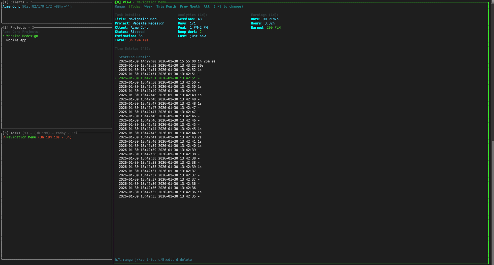

# Task Tracker

A terminal-based time tracker with vim keybindings.



Time tracker that

- Lives in my terminal
- Uses vim-style navigation (`j/k`, modes, single-key commands)
- Tracks clients, projects, and earnings

## Features

- **Time tracking** with live timer
- **Vim keybindings** - navigate with `j/k`, modes with `i/Esc`
- **Client management** with hourly rates and earnings calculation
- **Day navigation** - review and edit past entries
- **Toggl sync** - export to Toggl Track (basic)
- **Analytics** - sessions, peak hours, deep work tracking

## Quick Start

```bash
cp .env.example .env
# Set your password
docker compose up -d
```

## Basic Controls

| Key             | Action             |
| --------------- | ------------------ |
| `Tab` / `0-3`   | Switch sections    |
| `j` / `k`       | Navigate lists     |
| `i` / `Esc`     | Insert/Normal mode |
| `s`             | Start/Stop task    |
| `c` / `e` / `d` | Create/Edit/Delete |
| `q`             | Quit               |

## Discord

[Join the discussion](https://discord.gg/Rk3hME8rfq)

## License

MIT
